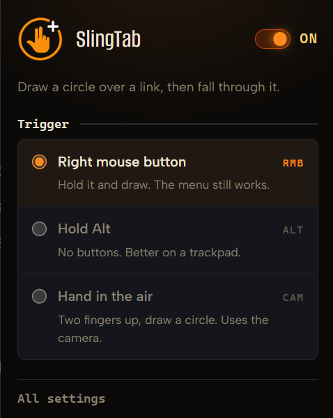

<a name="readme-top"></a>

<div align="center">


# SlingTab

### Punch a hole through the web.

**Draw a circle around a link — with the mouse, or with your bare hand in the air — and the page tears open inside the disc.**

[![Tests][tests-shield]][tests-url]
[![TypeScript][ts-shield]][ts-url]
[![Manifest V3][mv3-shield]][mv3-url]
[![Chrome 120+][chrome-shield]][chrome-url]
[![WebGL2][webgl-shield]][webgl-url]
[![License: MIT][license-shield]][license-url]
[![Stars][stars-shield]][stars-url]

[Getting Started](#getting-started) ·
[How It Works](#under-the-hood) ·
[Privacy](#privacy--security) ·
[Roadmap](#roadmap) ·
[Report a Bug][issues-url]

</div>

<div align="center">

[![SlingTab — a link is circled, the ring ignites, and the page dives through the portal][hero-gif]][hero-gif]

</div>

---

## About The Project

You are reading an article. A link catches your eye. You do not click it — you **circle it**.

A rim of embers ignites along the exact path you traced. The page ruptures inside the ring, and through the hole the destination is *already there*, live, while the surrounding page bends into it like light around a mass. Then the well deepens, the hole swallows the viewport, and you are through. No white flash. No blank tab. No seam.

That is the entire product. Everything below is what it takes to make it feel that way.

**SlingTab is a Chrome MV3 extension built with TypeScript, WebGL2, and a locally bundled MediaPipe hand-tracking model.** It composites a real-time gravitational-lens effect over a captured frame of the page you are on, renders the destination inside the puncture, and hands the viewport over to the real navigation at the precise moment the two are visually identical.

### Key Features

|   | |
|---|---|
| **Mouse *and* hand** | Right-button drag, an Alt-held trackpad stroke, or two raised fingers in front of your webcam. All three feed the **same pure recogniser**. |
| **A real gravitational lens** | Four WebGL2 passes — lens, vision, ring, sparks — over a `captureVisibleTab` snapshot. Graceful Canvas2D fallback when shaders will not compile. |
| **The destination, live** | The disc frames the real page where framing is allowed, and can strip `X-Frame-Options` for one sub-frame request in one tab. Otherwise it composes a 512×512 card from favicon, hostname, title and theme colour. |
| **12 000 instanced sparks** | Ribbons along an analytically reconstructed parabolic path — `p(-τ) = p − v·τ + ½gτ²` — so there is no per-particle history to store. 576k verts per frame. |
| **Nothing leaves the machine** | Webcam frames are read and discarded. MediaPipe's telemetry endpoint is severed at build time, and **the build fails** if it ever stops being found. |
| **A live tuner** | `npm run tune` loops the full timeline against the *same* renderer and shaders the extension ships, with HMR on the GLSL. |
| **162 tests, zero runtime deps** | The recogniser, the hand mapping, the filter, the header parsing and the shaders themselves are all unit-tested. Nothing ships at runtime except the deliberately bundled hand model. |

<p align="right"><a href="#readme-top">back to top &uarr;</a></p>

---

## Getting Started

### Prerequisites

| | |
|---|---|
| **Node.js** | Current LTS |
| **npm** | Ships with Node |
| **Chrome** | 120 or newer (`minimum_chrome_version`) |

A webcam is optional — it is required only for the hand trigger.

### Installation

```sh
git clone https://github.com/AtlasAnatomy/SlingTab.git
cd SlingTab
npm install
npm run build          # tsc --noEmit && vite build  ->  dist/
```

```sh
npm test               # optional - 162 unit tests
```

> [!NOTE]
> `dist/` lands at roughly 19 MB. Almost all of that is the verbatim MediaPipe
> WASM runtime and hand model, both vendored so the repository builds with no
> download step. First-party code is a rounding error next to it.

### Load it in Chrome

1. Open `chrome://extensions`
2. Enable **Developer mode** (top right)
3. Click **Load unpacked**
4. Select the `dist/` folder

That is it. Open any page and draw.

<p align="right"><a href="#readme-top">back to top &uarr;</a></p>

---

## Usage

### Triggers

| Trigger | How | Notes |
|---|---|---|
| **Right mouse button** *(default)* | Hold it and draw a circle around a link. | A right-click that does not become a circle still opens the context menu. |
| **Hold `Alt`** | No buttons at all — just move and draw. | The better option on a trackpad. |
| **Hand in the air** | Raise index and middle finger, fold ring and pinky, draw a circle at the webcam. | Requires one-time camera consent. |

Pick the trigger in the toolbar popup, or on the full settings page.

<div align="center">



</div>

### With your hand

1. Open the camera page from the popup and grant permission. **Consent is collected in a real tab, never in the popup** — the permission bubble takes focus, Chrome closes the popup, and the promise never settles.
2. Select the **Hand** trigger.
3. Raise two fingers and draw. A live trail of embers follows your fingertip while you are still drawing; the circle closes when the recogniser is satisfied.

The camera page doubles as a live diagnostic: it draws the **active box** — the region of the camera frame that maps onto your viewport — so the mapping constants can be judged by eye rather than by argument.

<div align="center">

[![Two fingers draw a circle in the air; a trail of embers follows the fingertip and the portal opens][hand-gif]][hand-gif]

</div>

### Tuning the look

```sh
npm run tune           # localhost:5180
```

The tuner loops the entire departure timeline against the **same `GLRenderer`, the same shaders and the same `SparkSystem`** the extension uses, with live sliders over every look parameter. HMR applies GLSL edits without a reload. `H` hides the panel, `Space` freezes a frame, clicking moves the ring, and **copy values** emits JSON to paste straight back into `DEFAULT_LOOK`.

> Do **not** tune by editing constants and reloading the unpacked extension.

<p align="right"><a href="#readme-top">back to top &uarr;</a></p>

---

## Under The Hood

### The departure

A gesture fires. What happens next is ordered with some care.

1. **The page is captured first, before any overlay exists.** Capture it after the ring is on screen and the lens bends a page with the ring already baked into it — a ghost ring under the real one.
2. **The target is resolved.** `elementsFromPoint` finds the nearest `<a href>`. Hand mode additionally searches a spiral inside the disc, because a hand in the air only lands roughly where you mean.
3. **The worker probes the destination** and answers `{mode:"iframe"}` or `{mode:"vision", …}` — an image, its kind, a theme colour, a title. Mode A does not wait on the probe at all; the probe runs behind it on a budget nothing blocks on.
4. **Prefetch hints go out** the instant the target is known — `prerender` same-origin, `prefetch` otherwise.
5. **The phases run.**

| Phase | ms | Behaviour |
|---|---:|---|
| `IGNITE` | 220 | The ring blooms outward from the centre; the full circle lights, sparks radially. |
| `OPEN` | 180 | The disc punctures; the lens well begins to form. |
| `HOLD` | until dismissed | The gravity well breathes. Closes on exactly two things: a click outside, or any key. |
| `COMMIT` / lens | 260 | The well deepens — the page bends into a stationary disc. |
| `COMMIT` / dive | 320 | Zoom 1 → 3.1. The hole opens past the viewport corners. |
| `WAITING` | ∞ | The destination has not arrived yet. Holds the dive's final geometry — no ring, no wash, nothing new drawn. |

6. **`PORTAL_COMMIT`** arms the handoff and releases the header rule. Navigation happens on the acknowledgement, with a 700 ms backstop so a dead service worker can never block it.

There is no arrival animation on the destination page, and that is deliberate — see *Engineering notes* below.

### The recogniser

[`src/content/gesture.ts`](src/content/gesture.ts) is pure, DOM-free, and covered by 31 tests. It accumulates turning angle about a running centroid; **the (−π, π] unwrap is the whole algorithm** — without it, every crossing of `atan2`'s branch cut injects a ±2π spike.

A gesture fires when all of these hold:

```text
|total turn| >= 1.75*pi        40 px <= rMean <= 0.45 * min(vw, vh)
rStd / rMean < 0.30            path length >= 150 px        >= 12 points
```

`trimLeadIn` drops a leading run of samples inside 80 % of the ring — people press the button *on the thing they want* and then swing outward, and those samples wreck the radius variance. It is capped at a third of the buffer so it cannot eat a lobe of a figure-eight. `explain()` reports which criterion failed and by how much; the **debug** option surfaces it once per attempt.

> A half circle turns about **4.25 rad** around its centroid, not π — the centroid of an arc sits inside it. The margin to the 5.50 threshold is smaller than it looks.

### The hand pipeline

```text
offscreen document (webcam) -> service worker -> active tab
```

MediaPipe Hand Landmarker, 21 landmarks, bundled locally, running on a `setInterval` at 33 ms — **never `requestAnimationFrame`**, because an offscreen document is never rendered and those callbacks never fire.

The fingertip then crosses three deliberate stages before it reaches the recogniser:

- **The active box** ([`handmap.ts`](src/shared/handmap.ts)) — a centred rectangle of the camera frame, sized to the *viewport's* aspect ratio and stretched onto the whole viewport. A hand never reaches the corners of the frame (shoulders, field of view, arm length), and a 4:3 camera normalised independently on each axis turns a physical circle into an ellipse 1.33× wider than tall on a 16:9 screen — while the recogniser, seeing a perfect circle, fires happily. The box fixes both. Coverage is 0.92 of the frame width.
- **A One Euro filter** — the box amplifies jitter by exactly as much as it amplifies motion, so the amplified fingertip is filtered before anything reads it.
- **Asymmetric hysteresis** — 3 good frames to arm, 9 bad to disarm. Landmark inference flickers, and at 25 fps a one-second circle offers 25 chances to lose the whole stroke.

The result feeds **the same pure recogniser the mouse uses**. While armed, `HAND_PREVIEW` streams at 22 Hz and the departure **adopts the preview's overlay** rather than rebuilding it.

<details>
<summary><b>Verified platform constraints — do not "simplify" these</b></summary>

<br>

Each of these was discovered the hard way and is load-bearing.

| Constraint | What the code does |
|---|---|
| `document.body` is null at `document_start` | The overlay host mounts on `documentElement`. |
| Content scripts cannot read `storage.session` | State lives in the worker; `setAccessLevel` is deliberately not called. |
| No `DOMParser` or `XMLHttpRequest` in a worker | Regex over the first 64 KB of markup. |
| No `URL.createObjectURL` in a worker | Chunked (8192 B) `btoa` into a `data:` URL. |
| `sendMessage` JSON-serialises | Only the base64 string crosses. Never a buffer. |
| Cross-origin images taint or throw on upload | Fetched in the worker, delivered as `data:`. |
| `captureVisibleTab` is active-tab only | Used only on the sender's own tab. |
| `SameSite=Lax` skips cross-site frames | Framed sites appear logged out. The UI says so. |
| Sites with their own service worker never hit the network | The iframe reveal is a deadline, not a teardown. |
| No injection on `chrome://`, the PDF viewer, or the Web Store | Every path degrades to a plain `location.href`. |
| Page CSS can reach the host element | Random tag name, closed shadow root, inline `!important`. |
| `prefers-reduced-motion` | The animation is skipped; navigate directly. |
| An offscreen document is never rendered | The tracker uses `setInterval`, never `rAF`. |
| Chrome closes a popup that loses focus | Camera consent happens in a tab. |

</details>

<details>
<summary><b>Engineering notes — the expensive lessons</b></summary>

<br>

The full ledger lives in [HANDOFF.md][handoff-url], with root causes recorded so they are not reintroduced. A representative few:

- **Never transform `<html>`.** A `transform` on the root element makes it the containing block for fixed-position descendants — so the overlay host's `inset: 0` began resolving against the *document* height, and the host grew thousands of pixels tall while its drawing buffer stayed viewport-sized. The DOM dive was deleted outright; the dive is now a uniform in `lens.frag`.
- **Premultiplied alpha, applied twice.** The context was created with `premultipliedAlpha: false` while the additive passes leave the framebuffer already premultiplied. The compositor multiplied by alpha a second time, so a fragment of intensity `i` reached the screen at `i³`. A 0.3 glow composited at 0.027.
- **Never clamp the argument of a Gaussian.** `exp(-sq(max(0.0, sweep - rel) / 0.26))` returns **1.0** everywhere ahead of the sweep, because the clamp makes the argument zero — so the entire ring lit while only an arc had been traced. There is now a test that forbids the pattern in any shader, and another asserting every additive ring term sits inside the arc mask.
- **The fallback that could never engage.** `GLRenderer` acquires the WebGL2 context *before* compiling shaders, so on a shader failure `getContext("2d")` returns null forever on that canvas. The Canvas2D fallback threw, `createOverlay()` returned null, and the whole feature degraded silently to a plain navigation. The fallback now mounts a fresh canvas.
- **`use_dynamic_url: true` bricks the extension.** It looks like the free fix for the fingerprinting exposure below. Chrome then refuses the static path, the `@crxjs` loader dies on a failed dynamic import, and there is **no content script at all** on any page — with nothing in the extension's error list to explain it. Reverted, with the reasoning recorded in `vite.config.ts`.
- **Two tunnels.** The dive opened a hole past the viewport corners, and then the arriving page opened a second hole from the same centre — one gesture, the same visual twice. Removing the arrival took a synchronous visibility prelude with it, and that prelude had been hiding `<html>` on **every page load in the browser**, portal or not, waiting on a service-worker round trip before first paint. That tax is gone.

</details>

<p align="right"><a href="#readme-top">back to top &uarr;</a></p>

---

## Privacy & Security

**Nothing is exfiltrated. Everything happens on the machine.**

- **The webcam is processed locally.** Frames are read and discarded — never recorded, uploaded or stored. The camera runs only while the hand trigger is selected, and the hand model is bundled, so it works offline.
- **MediaPipe's telemetry is severed at build time.** The library batches usage events and POSTs them to a Google logging endpoint every 60 seconds. A Vite plugin rewrites that URL to a path that 404s, and **the build fails if the endpoint is not found** — a dependency upgrade cannot quietly reintroduce it. Verify with `npm run build && grep -r "odml.pa.googleapis" dist/`.
- **The page snapshot never leaves the tab.** It is `captureVisibleTab` on your own active tab, and it is dropped when the portal closes.
- **Preview fetches use `credentials: "omit"`**, so nothing personalised is pulled into a preview.
- **No injection sinks.** No `innerHTML`, `outerHTML`, `insertAdjacentHTML`, `document.write`, `eval` or `new Function` in first-party code — every node is built with `createElement` and `textContent`. Every URL reaching `location.href` or an `iframe.src` passes an `^https?://` test, so `javascript:`, `data:`, `file:` and `chrome-extension:` cannot get through.
- **Minimal permissions.** `storage`, `declarativeNetRequestWithHostAccess`, `favicon`, `offscreen` and `<all_urls>`. **No `tabs`** (the worker reads `sender.tab.id`), no `scripting`, no `webRequest`, no `cookies`, no `downloads`.
- **No page can talk to the worker.** There is no `externally_connectable`. Hand messages are additionally gated on `!sender.tab`, so a content script cannot synthesise a gesture for another tab.
- **Semgrep:** 189 rules across `p/javascript`, `p/typescript`, `p/xss`, `p/secrets`, `p/command-injection` and `p/owasp-top-ten` — **0 findings**. A generic ruleset knows nothing about an extension's threat model, so the manual review in HANDOFF §13 is the real one.

### Stated plainly

Two things are worth saying out loud rather than burying:

1. **Circling a link fetches that URL before you commit.** The site learns you looked, the way a hover-prefetch would.
2. **Mode A opens a narrow clickjacking window.** Framing a site that refuses framing means stripping `X-Frame-Options` and CSP for that host — and a declarative rule cannot be scoped to a single frame, so for a few hundred milliseconds the protection is off for any frame in that tab. It requires a deliberate gesture on a link to that exact target; the rule is dropped the instant our own preview loads; and our frame is inert (`pointer-events: none`, no forms, no popups, no top navigation — clickjacking needs a click to steal, and there is none). **The setting can be turned off**, and then no rule is ever created.

**One known exposure is accepted, not fixed:** `@crxjs` must list the content-script chunk in `web_accessible_resources` at a path that is stable under a published extension's fixed id, so any site can probe it and learn SlingTab is installed. The documented mitigation does not work here — see the note on `use_dynamic_url` above.

Both points are stated in the product itself, not only here. The settings page spells out exactly which headers are removed, how long the rule lives, and why the framed page cannot be clicked:

<div align="center">

[![The SlingTab settings page, with the portal options and an in-product explanation of what header stripping does][options-png]][options-png]

</div>

<p align="right"><a href="#readme-top">back to top &uarr;</a></p>

---

## Testing

```sh
npm test          # vitest run
npm run typecheck # tsc --noEmit
```

**162 tests across 12 files**, all pure — no browser, no camera, no GPU.

| Suite | Covers |
|---|---|
| `gesture.test.ts` | Angle unwrap, CW/CCW circles, rejection of lines, half-circles, figure-eights and scribbles, lead-in trim, `explain()`. |
| `preview.test.ts` | `og:image` priority, title and description extraction, relative URL resolution, entity decoding, CSP/XFO framability, chunked base64, colour parsing. |
| `handmap.test.ts` | The active box matches the viewport's aspect *physically*; every screen corner is reachable; a circle in the air stays a circle (`rStd/rMean < 0.01`); NaN-proofing. |
| `onefilter.test.ts` | Convergence, jitter halved at rest, under 80 ms lag at 2 screens/s, beats a fixed low-pass at speed, survives repeated and backwards timestamps. |
| `settings.test.ts` | `patchSettings` leaves untouched fields alone and **never silently disables the extension**; schema migration; pre-rename keys are read and moved once. |
| `shaders.test.ts` | Uniform names cross-checked against `gl.ts` *parsed from the source*, so the test cannot go stale; no `pow()` on a base that can go negative; no clamped-argument Gaussian. |
| `glsl-syntax.test.ts` | All six shaders parsed with a real GLSL parser in Node; every called function is builtin or locally defined. |
| `handpose.test.ts` · `handpreview.test.ts` · `wasmlog.test.ts` · `linkimport.test.ts` | The two-finger gate, particle budget headroom, WASM log routing, and the quick-link import parser. |

**Not covered:** GLSL type errors and driver behaviour (needs a real compile), the webcam path end to end (needs a camera), and the manual acceptance matrix.

<p align="right"><a href="#readme-top">back to top &uarr;</a></p>

---

## Roadmap

- [x] Rebuild the popup and options pages on one shared token system
- [x] Bring `camera.html` onto the same visual language
- [x] Sever MediaPipe's telemetry at build time, with a failing build as the guard
- [x] Route WASM log chatter away from the extension's error list
- [ ] **Walk the manual acceptance matrix in a real browser** — framing behaviour on popular sites, service-worker kill, `* { all: unset }` pages, the PDF viewer, `chrome://` inertness, session rules empty after 20 gestures
- [ ] Tune the lens constants (`LENS_PEAK`, `SWIRL_PEAK`, `DIVE_ZOOM`) by eye — they are reasoned, not measured
- [ ] Fine-tune the One Euro parameters and the active-box coverage against a real webcam
- [ ] A per-host skip list for sites that render a login wall when framed
- [ ] Make sparks readable on light pages — they blend additively and cannot darken, so the ring reads as a white-out
- [ ] A first-run onboarding flow

See the [open issues][issues-url] for the full list.

<p align="right"><a href="#readme-top">back to top &uarr;</a></p>

---

## Contributing

Contributions are what make the open-source community what it is. Any contribution you make is **greatly appreciated**.

1. Fork the project
2. Create your feature branch — `git checkout -b feature/amazing-feature`
3. Make your change, and **add a test if the logic is pure**
4. Verify — `npm test && npm run typecheck && npm run build`
5. Commit — `git commit -m 'Add some amazing feature'`
6. Push — `git push origin feature/amazing-feature`
7. Open a Pull Request

Or simply open an issue with the tag `enhancement`.

### Before you send a PR

- **[HANDOFF.md][handoff-url] is the reference document**, and the only one kept current. If you are tempted to explain a mechanism in the README, explain it there instead.
- **Do not tune the look by editing constants.** Use `npm run tune`.
- **`tests/` cannot see a manifest key.** If you change the manifest, load `dist/` unpacked and draw a circle before believing it works.
- **Read the bug ledger before "simplifying" anything.** Most of the odd-looking code in this repository is odd for a reason that took a day to find.

<p align="right"><a href="#readme-top">back to top &uarr;</a></p>

---

## License

Distributed under the **MIT License**. See [`LICENSE`][license-url] for the full text.

<p align="right"><a href="#readme-top">back to top &uarr;</a></p>

---

## Acknowledgments

- [MediaPipe Tasks Vision][mediapipe-url] — the hand landmarker, bundled locally and running offline
- [Vite][vite-url] — the build
- [@crxjs/vite-plugin][crxjs-url] — MV3 manifest generation and HMR
- [Vitest][vitest-url] — the test runner
- [@shaderfrog/glsl-parser][glslparser-url] — real GLSL parsing in Node, so shader syntax is a unit test
- [The One Euro Filter][onefilter-url] — Casiez, Roussel & Vogel, CHI 2012
- [Alumni Sans][alumni-url] and [Albert Sans][albert-url] — self-hosted, OFL
- [Best-README-Template][template-url] — the scaffold this document is built on

<p align="right"><a href="#readme-top">back to top &uarr;</a></p>

<!-- SHIELDS -->
[tests-shield]: https://img.shields.io/badge/tests-162%20passing-brightgreen?style=for-the-badge&logo=vitest&logoColor=white
[tests-url]: #testing
[ts-shield]: https://img.shields.io/badge/TypeScript-strict-3178C6?style=for-the-badge&logo=typescript&logoColor=white
[ts-url]: https://www.typescriptlang.org/
[mv3-shield]: https://img.shields.io/badge/Manifest-V3-4285F4?style=for-the-badge&logo=googlechrome&logoColor=white
[mv3-url]: https://developer.chrome.com/docs/extensions/develop/migrate
[chrome-shield]: https://img.shields.io/badge/Chrome-120%2B-F97316?style=for-the-badge&logo=googlechrome&logoColor=white
[chrome-url]: https://www.google.com/chrome/
[webgl-shield]: https://img.shields.io/badge/WebGL2-GLSL%20ES%203.0-990000?style=for-the-badge&logo=webgl&logoColor=white
[webgl-url]: https://registry.khronos.org/webgl/specs/latest/2.0/
[license-shield]: https://img.shields.io/badge/License-MIT-FFD27A?style=for-the-badge
[license-url]: LICENSE
[stars-shield]: https://img.shields.io/github/stars/AtlasAnatomy/SlingTab?style=for-the-badge&color=FF8A1F
[stars-url]: https://github.com/AtlasAnatomy/SlingTab/stargazers

<!-- MEDIA -->
[hero-gif]: assets/hero_gif.gif
[hand-gif]: assets/hand_gesture.gif
[options-png]: assets/UI_Tuner.png

<!-- LINKS -->
[issues-url]: https://github.com/AtlasAnatomy/SlingTab/issues
[handoff-url]: HANDOFF.md
[mediapipe-url]: https://ai.google.dev/edge/mediapipe/solutions/vision/hand_landmarker
[vite-url]: https://vitejs.dev/
[crxjs-url]: https://crxjs.dev/vite-plugin
[vitest-url]: https://vitest.dev/
[glslparser-url]: https://github.com/ShaderFrog/glsl-parser
[onefilter-url]: https://gery.casiez.net/1euro/
[alumni-url]: https://fonts.google.com/specimen/Alumni+Sans
[albert-url]: https://fonts.google.com/specimen/Albert+Sans
[template-url]: https://github.com/othneildrew/Best-README-Template
